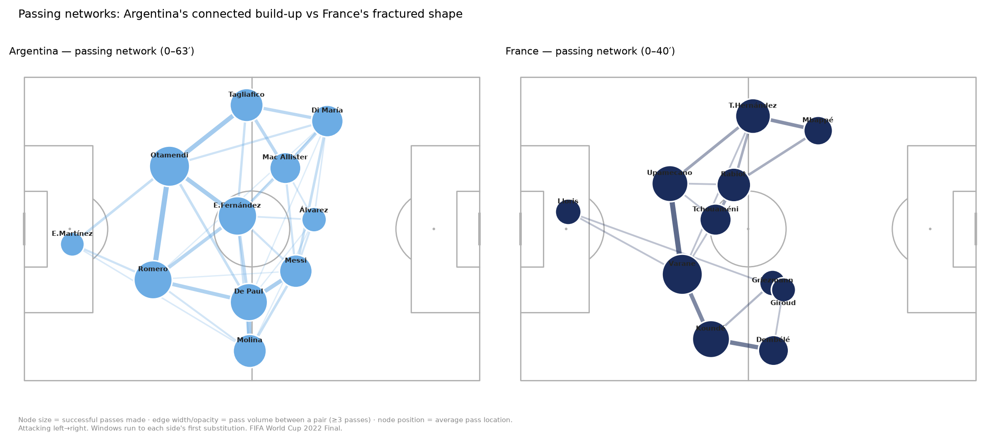
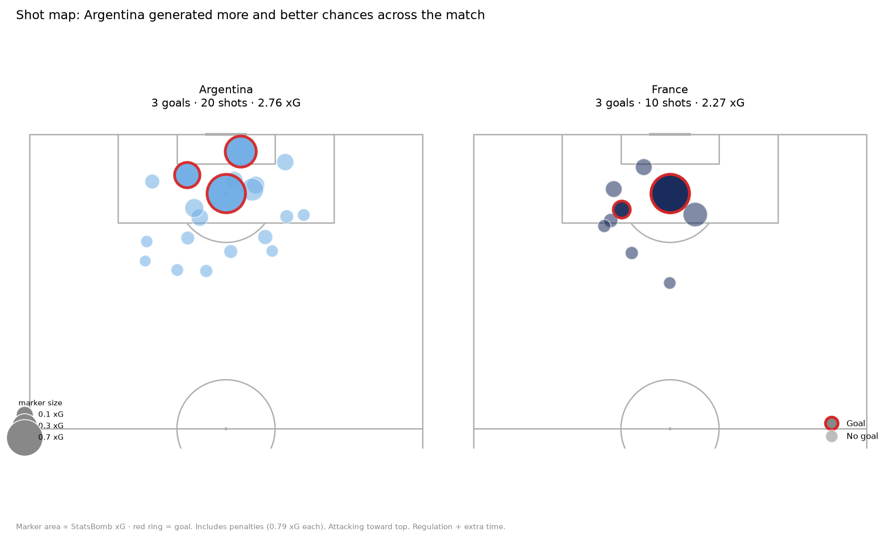
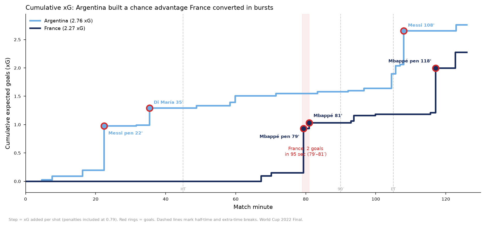
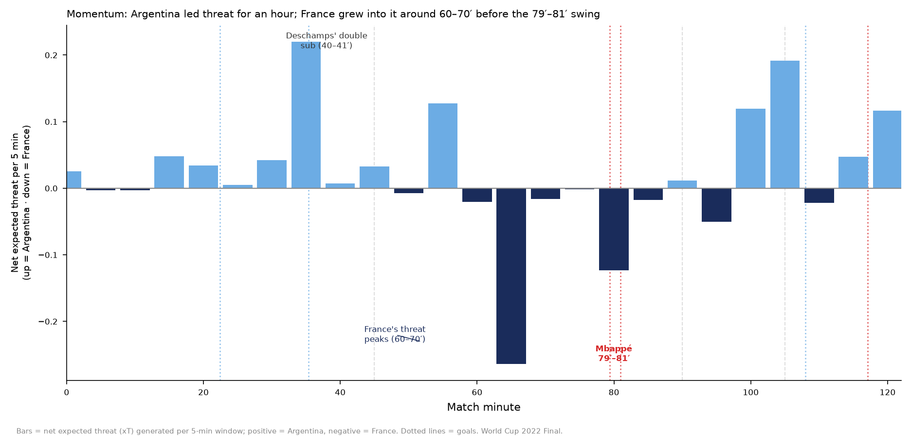
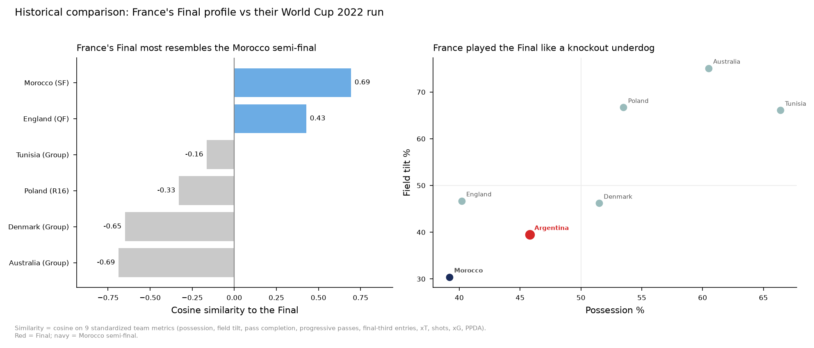

# OpenFootball Intelligence (OFI)

> **Ask why. Get tactical evidence.**
> An open, reusable layer that turns soccer event data into tactical explanations grounded in reproducible Python.

OFI is not a one-off dashboard — it's a small metric-and-workflow library any
analyst (or AI agent) can load to answer *why* something happened in a match,
not just *what*. This repo contains the library, a fully worked demo on real
data, and the positioning narrative behind it.

**Demo match:** Argentina 3–3 France (Argentina win 4–2 on penalties) — FIFA
World Cup 2022 Final. Data: [StatsBomb open data](https://github.com/statsbomb/open-data) (4,407 events, `match_id 3869685`).

---

## The worked example

**Question:** *Why was France passive for 70 minutes before their comeback?*

Argentina dominated for ~70 minutes (France had **0 first-half shots**;
half-time xG 1.29–0.00). France's passivity was *imposed* by Argentina's ball
retention and first-phase press, then *situational* — a 2-goal deficit, not a
tactical solution, triggered France's front players forward, producing **two
goals in 95 seconds** (79′–81′). France's Final profile most resembled their
**Morocco semi-final**: a low-possession, transition-based knockout template.

Full analysis in [`analysis_report.md`](analysis_report.md).

### Figures

| Passing networks | Shot map |
|---|---|
|  |  |

| Cumulative xG | Momentum (net xT / 5 min) |
|---|---|
|  |  |



---

## The library

`ofi.py` (also packaged as a Claude Science skill in [`skill/`](skill/)) provides:

| Function | Returns |
|---|---|
| `load_match(match_id)` | events DataFrame with coords attached |
| `team_metrics(df)` | possession, field tilt, passing, progression, entries, xT, shots/xG/goals, PPDA |
| `field_tilt(df)` / `possession_share(df)` / `ppda(df, team)` | territory & pressing metrics |
| `xt_added(df)` | expected-threat added per successful pass/carry |
| `passing_network(df, team)` | (nodes, edges) with avg location + betweenness centrality |
| `phase_split(df, windows)` | per-team metrics within minute windows |
| `similarity_rank(vectors, target, features)` | cosine-similarity ranking of matches |

xG totals are validated against StatsBomb's published figures (match to 2 dp).
xT uses the open [Karun Singh](https://karun.in/blog/expected-threat.html) 12×8 grid.

### Quickstart

```bash
pip install -r requirements.txt
python examples/run_final.py        # reproduces the demo metrics
```

```python
import ofi
m = ofi.load_match(3869685)          # any StatsBomb open-data match id
ofi.team_metrics(m)                  # headline metrics
nodes, edges = ofi.passing_network(m, "France")
ofi.phase_split(m, [(0,45,"1H"), (45,90,"2H"), (90,120,"ET")])
```

---

## Repo layout

```
ofi.py                 # the metric library
skill/                 # SKILL.md + kernel.py (Claude Science skill form)
analysis_report.md     # the worked "why" analysis
OFI_positioning.md     # the "infrastructure layer, not a demo" narrative
figures/               # the five tactical figures
data/                  # raw events (parquet) + computed metric tables
examples/run_final.py  # reproduce the demo
```

## Why this framing

See [`OFI_positioning.md`](OFI_positioning.md) — the case for OFI as an open
infrastructure layer for AI-native football analysis rather than another demo.
**More AI. Less engineering.**

## License & data

Code: MIT. Event data © StatsBomb, provided free for public use under the
[StatsBomb open-data terms](https://github.com/statsbomb/open-data) — please
credit StatsBomb in any derived work.
